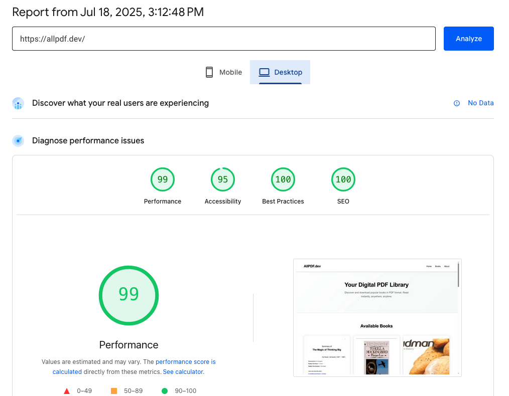
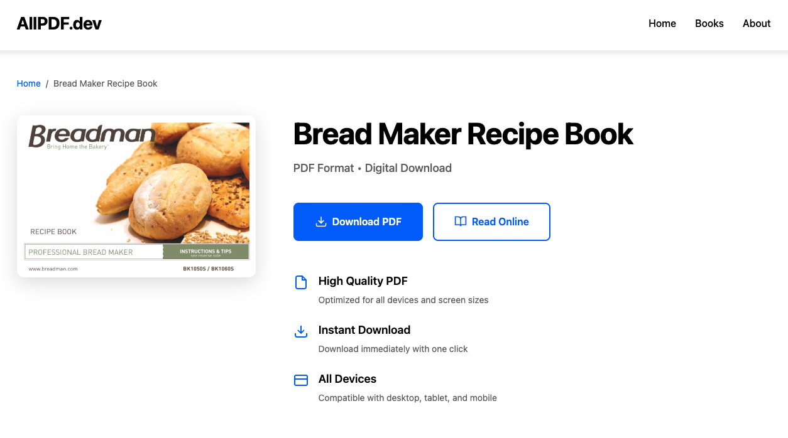

# AllPDF.dev - Digital PDF Library

A modern web application built with Astro that provides instant access to downloadable PDF books. AllPDF.dev offers a curated collection of books in PDF format with an intuitive interface for browsing, searching, and downloading.




## ✨ Features

- **Instant Downloads**: One-click PDF downloads with no registration required
- **Responsive Design**: Optimized for all devices - desktop, tablet, and mobile
- **Fast Performance**: Built with Astro for lightning-fast page loads
- **SEO Optimized**: Structured data and meta tags for better search visibility
- **Clean Interface**: Modern, minimalist design for better user experience
- **Pagination**: Efficient browsing through large book collections

## 🚀 Project Structure

```text
/
├── public/
│   ├── favicon.ico
│   ├── files/                  # PDF and image files
│   └── robots.txt
├── src/
│   ├── components/
│   │   ├── BookCard.astro     # Individual book display component
│   │   ├── Footer.astro       # Site footer
│   │   ├── Header.astro       # Site header with navigation
│   │   ├── Pagination.astro   # Page navigation component
│   │   └── SearchBar.astro    # Search functionality
│   ├── data/
│   │   └── books.json         # Book data and metadata
│   ├── layouts/
│   │   └── Layout.astro       # Base layout template
│   └── pages/
│       ├── book/
│       │   └── [slug].astro   # Dynamic book detail pages
│       ├── page/
│       │   └── [page].astro   # Paginated book listing
│       └── index.astro        # Homepage
├── astro.config.mjs           # Astro configuration
└── package.json
```

## 🧞 Commands

All commands are run from the root of the project, from a terminal:

| Command                   | Action                                           |
| :------------------------ | :----------------------------------------------- |
| `npm install`             | Installs dependencies                            |
| `npm run dev`             | Starts local dev server at `localhost:4321`      |
| `npm run build`           | Build your production site to `./dist/`          |
| `npm run preview`         | Preview your build locally, before deploying     |
| `npm run astro ...`       | Run CLI commands like `astro add`, `astro check` |
| `npm run astro -- --help` | Get help using the Astro CLI                     |

## 🚀 Getting Started

1. **Clone the repository**
   ```bash
   git clone <repository-url>
   cd allpdf.dev
   ```

2. **Install dependencies**
   ```bash
   npm install
   ```

3. **Start the development server**
   ```bash
   npm run dev
   ```

4. **Open your browser** and navigate to `http://localhost:4321`

## 📦 Building for Production

```bash
npm run build
```

The built site will be generated in the `dist/` directory, ready for deployment to any static hosting service.

## 🎯 Adding New Books

To add new books to the collection:

1. Add PDF and cover image files to the `public/files/` directory
2. Update the `src/data/books.json` file with the new book information:
   ```json
   {
     "title": "Book Title",
     "src_pdf": "https://allpdf.dev/files/book-folder/book.pdf",
     "src_pic": "https://allpdf.dev/files/book-folder/cover.jpg"
   }
   ```

## 🛠️ Tech Stack

- **[Astro](https://astro.build)** - Static site generator
- **HTML/CSS/JavaScript** - Frontend fundamentals
- **JSON** - Data storage for book metadata

## 📄 License

This project is open source and available under the [MIT License](LICENSE).

## 🤝 Contributing

Contributions are welcome! Please feel free to submit a Pull Request.

## 📞 Support

For support or questions, please open an issue in the repository.
